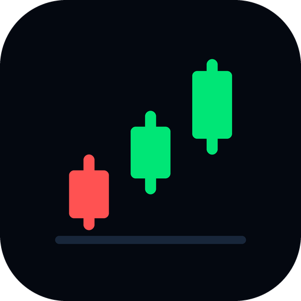

<div align="center">



# ScalpAI

<p>
  
  
  
  
  
  
</p>

<p>
  <a href="#running-it"><b>Run it</b></a> &nbsp;&#183;&nbsp;
  <a href="engine/README.md"><b>The engine</b></a> &nbsp;&#183;&nbsp;
  <a href="engine/README.md#backtesting"><b>Backtesting</b></a> &nbsp;&#183;&nbsp;
  <a href="engine/README.md#paper-trading"><b>Paper trading</b></a> &nbsp;&#183;&nbsp;
  <a href="#what-it-has-measured"><b>What it measured</b></a> &nbsp;&#183;&nbsp;
  <a href="ALGO-PLAN.md"><b>The plan</b></a>
</p>

</div>

An intraday scalping dashboard for NIFTY, SENSEX and BANK NIFTY, and a Python
engine behind it whose main job is to find out whether any of it pays. So far
it has mostly answered no, in writing, with the numbers attached.

Two halves that can run apart. The dashboard is a Next.js app that works on its
own against free Yahoo data and deploys to Vercel unchanged. The engine is a
local Python process that owns the deeper market data, the backtest, the learned
filter and the paper trader; point the dashboard at it and the chart renders the
same Fyers-sourced bars the backtest scored, leave it unset and nothing breaks.

<table>
<tr>
<td width="33%" valign="top">

### &#128225; It watches

NIFTY, SENSEX and BANK NIFTY on 5-minute bars, plus your own stocks and ETFs.
Every free provider serves a rolling window, so the engine merges each pull into
a local archive and turns a disappearing window into history you own.

</td>
<td width="33%" valign="top">

### &#128207; It measures

The strategy is ported to Python and pinned by tests that run the real
JavaScript under Node and diff the output, because a backtest of an
*approximation* of your strategy tells you nothing about your strategy.

</td>
<td width="33%" valign="top">

### &#128683; It refuses

Costs are measured per volatility regime rather than assumed, and most
candidates do not survive that. The ones that fail stay in the tree with their
numbers, wired to nothing.

</td>
</tr>
</table>

## Running it

The dashboard alone, which needs no keys and no broker:

```bash
npm install
npm run dev                 # then open http://localhost:3000
```

Live index prices come from Yahoo, which needs no account. The header reads
**LIVE** when real data is connected and **DEMO** when it is not. Charts,
indicators, signals, the portfolio tracker and the signal log all work at this
point; the AI assistant needs a key, and the backtest needs the engine.

The engine, for the deep archive, the backtest and paper trading:

```bash
python3 -m venv .venv
.venv/bin/pip install -r engine/requirements.txt

.venv/bin/python -m engine.cli status      # market open or shut
.venv/bin/python -m engine.cli probe       # which providers answer
.venv/bin/python -m engine.cli sync        # bank candles locally
.venv/bin/python -m engine.cli backtest --show 20
```

`./start.sh` wraps the daily routine — `morning`, `paper`, `dashboard`,
`fyers`, `sync`, `status`, `setup` — and `./start.sh help` lists the rest.

To serve the dashboard from the engine rather than Yahoo, start
`python -m engine.cli serve` and set `ENGINE_URL=http://127.0.0.1:8787`. The
routes prefer it and fall back to Yahoo whenever it is down, has nothing
archived for that symbol, or knows its own bars are behind the tape.

## What it has measured

The results are the point of the project, so they belong in front rather than
three pages in. Both of these are one backtest against an assumed cost model,
and both are written up in full in [the engine README](engine/README.md).

**The production strategy is not edgeless, and loses to costs.** Gross profit
factor 1.21, then the round trip eats it. Filtering it with a walk-forward
validated model moves the recent out-of-sample period from −0.69 to **+8.08 net
points a trade**, robust across seeds — but that is roughly 25 trades a year,
and the conclusion already flipped once when costs were priced at the volatility
that actually prevailed instead of a calm day's snapshot.

**The EMA 9 × VWAP cross does not pay.** The most widely traded NIFTY setup
going, replayed over 246 fully volumed sessions: 510 crosses, 118 taken, a 25.4%
win rate and **−9.71 net points a trade**, with 0 of 2 positive years. The
mechanism is visible in the replay — a ₹800 stop is about 20 index points and
the nearest support or resistance is frequently nearer than that, so the
reward:risk floor refuses 66% of crosses, and widening the stop makes the gate
bite harder rather than easier.

The more useful half of that second result is about data, not strategy. NIFTY is
an index, so it has no volume of its own, and a volume-weighted average price is
undefined without volume: only **269 of 2,260 archived sessions** carry any. The
obvious fallback of using the close produces a "VWAP" line that *is* the close,
which silently measures a strategy nobody described. Anyone reading a VWAP line
on a NIFTY index chart is reading a volume proxy their platform chose.

It is on the dashboard anyway, as a panel with its own number on it, wired to
nothing that trades. A guard test fails the build if it ever reaches the
decision path.

## The documentation

| | |
| --- | --- |
| [The engine](engine/README.md) | Setup, layout, and why the strategy was ported rather than reimplemented |
| [Market data](engine/README.md#market-data) | The providers compared, the local archive, and the daily Fyers login |
| [Backtesting](engine/README.md#backtesting) | Replay, variants, and the walk-forward filter |
| [What a round trip costs](engine/README.md#what-a-round-trip-really-costs) | Spread, slippage and IV, measured per regime instead of assumed |
| [Paper trading](engine/README.md#paper-trading) | Running the decision path against the live market with no orders |
| [The EMA 9 / VWAP cross](engine/README.md#the-ema-9--vwap-cross-measured) | The full measurement, and the volume problem underneath it |
| [Serving the dashboard from the engine](engine/README.md#serving-the-dashboard-from-the-engine) | The read-only JSON seam, and the three ways it declines to answer |
| [The algo plan](ALGO-PLAN.md) | Phases from dashboard to executing algo, each ending in a gate |

## The layout

```
app/        the dashboard: Next.js App Router, one page and its API routes
app/lib/    indicators, signals and the strategy the engine mirrors in Python
engine/     data adapters, local archive, backtest, research, ml, paper trader
public/     the installable-app pieces: manifest, service worker, icons
scripts/    the morning routine, paper sessions, sync and status checks
```

Everything the engine writes — the SQLite archive, the Fyers token, fitted
models, paper books — stays under `engine/var/`, so none of it is in the way of
a deploy.

## On your phone

Deployed over HTTPS, the dashboard installs as a real app: Chrome builds an
Android package for it, so it gets a launcher icon, no address bar and its own
entry in the app switcher. **Chrome ⋮ → Install app**, or **Share → Add to Home
Screen** on iOS. If you added it to your home screen before, delete that icon
first — it is a bookmark, and it will keep opening in the browser.

Install needs a secure origin, so `http://<lan-ip>:3000` cannot offer it however
the manifest is written. The service worker deliberately never caches `/api`
responses: a cached quote would render as a live price with nothing on screen
admitting its age, so offline shows a page with no numbers on it at all.

The phone's back gesture unwinds the app — article, then detail sheet, then the
assistant, then the tab — instead of closing it from wherever you happen to be.

## Configuring

Copy `.env.example` to `.env.local`. Everything in it is optional; the
dashboard runs with all of it blank.

| | |
| --- | --- |
| `GEMINI_API_KEY` | Ask EA and the chat assistant. Free key from [AI Studio](https://aistudio.google.com/apikey) |
| `GROQ_API_KEY` | Fallback, used only when Gemini has no key or errors |
| `FYERS_CLIENT_ID` · `FYERS_SECRET_KEY` · `FYERS_REDIRECT_URI` | The engine's market data and option chain. Tokens expire daily, so `engine.cli fyers-auth` is a morning ritual |
| `ENGINE_URL` | Serve charts and quotes from the engine. Unset means Yahoo |
| `UPSTASH_REDIS_REST_URL` · `_TOKEN` | The signal log, and the background-alerts switch the cron reads |
| `TELEGRAM_BOT_TOKEN` · `TELEGRAM_CHAT_ID` | Where background alerts are sent |
| `CRON_SECRET` | Guards `/api/nifty-log/cron` |
| `FINNHUB_API_KEY` | Optional. Its free tier excludes Indian indices, so Yahoo is the default |

### Alerts with the app closed

The in-app sound and notification come from a timer in the page, so they stop
the moment the tab is backgrounded or the phone locks. Installing the site does
not change that — it is the same frozen timer. To be alerted with the app shut,
the signal has to be evaluated on the server: `/api/nifty-log/cron` runs the
whole evaluation with no browser involved and pushes new signals to Telegram.

Set the Upstash pair, the Telegram pair and `CRON_SECRET`, redeploy, then point
a scheduler at it. Vercel Hobby caps cron at once a day, so use an external one
such as [cron-job.org](https://cron-job.org), restricted to Mon–Fri 09:15–15:30
IST. **Every two minutes** is the interval to pick: each tick rewrites the whole
log blob, so Upstash bandwidth is the limit you would reach first, and signals
are scored on 5-minute candles so a faster poll buys nothing.

Append `&test=1` to that URL to get a Telegram test message and a config
readout; any `false` in it is the thing to fix. Alerts fire on **new** signals
only, so a call that persists updates its log row without messaging you again.

**Settings → Alerts → Background alerts** is the master switch, stored on the
server rather than in your browser so the cron can see it. With it off each call
returns after one cheap read — which pauses the signal log too, not just the
messages.

## Troubleshooting

| Symptom | Fix |
| --- | --- |
| Header shows **DEMO** | Check `/api/market?symbol=%5ENSEI` returns `"source"` as `yahoo` or `fyers` |
| Chart is hours behind | The Fyers token expired overnight. `engine.cli fyers-auth`, or clear `ENGINE_URL` to fall back to Yahoo |
| VWAP panel reads "no volume" | Expected on Yahoo data, which reports zero volume for an index. It needs the engine |
| Assistant says it is not configured | Add `GEMINI_API_KEY` and redeploy |
| Prices frozen | Market hours are 09:15–15:30 IST; outside them the last close is correct |
| No install option on the phone | Install needs HTTPS. A LAN IP over plain HTTP cannot offer it |

## Licence

None yet — there is no `LICENSE` file in this tree, which means default
copyright: nobody else has permission to use, copy or adapt it. That is the
right default for something that has not decided what it wants to be, and the
wrong one to leave in place if this is ever shared.
